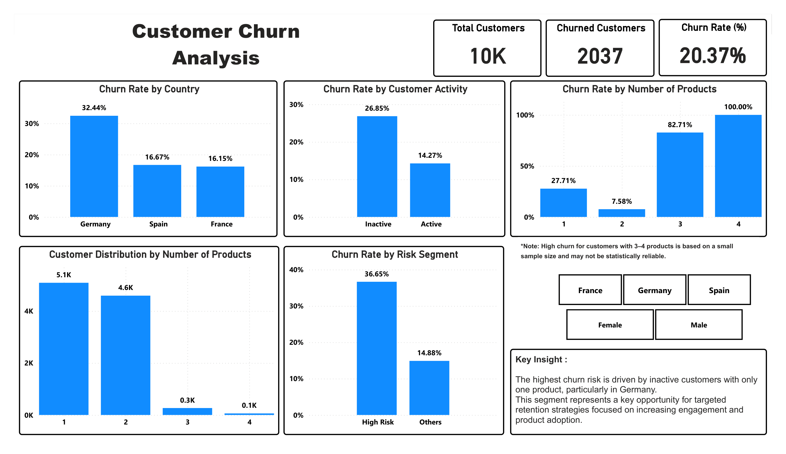

# 📊 Customer Churn Analysis (Banking Dataset)

## 📌 Project Overview

This project analyzes customer churn behavior in a banking dataset to identify key risk factors and provide actionable business recommendations to improve customer retention.

The goal is to answer:

> **Why are customers leaving, and what can the business do to reduce churn?**

---

## 🎯 Business Objectives

* Measure overall churn rate
* Identify high-risk customer segments
* Understand key drivers of churn
* Provide data-driven recommendations to improve retention

---

## 🛠 Tools Used

* **Excel** – Data cleaning & preparation
* **Power BI** – Data visualization & dashboard
* **DAX** – KPI calculations (Churn Rate, Customer Count)

---

## 📊 Key Metrics

* **Total Customers:** 10,000
* **Churned Customers:** 2,037
* **Churn Rate:** 20.37%

---

## 🔍 Key Findings

1. Germany has the highest churn rate (~32%), significantly higher than other regions.
2. Inactive customers have a much higher churn rate (~27%) compared to active customers (~14%).
3. Customers with only one product show higher churn (~28%) compared to those with two products (~8%).
4. The highest churn risk comes from customers who are **inactive and use only one product**.

---

## 🧠 Business Insights

* Customer inactivity is strongly linked to churn, indicating low engagement is a key driver of customer loss.
* Low product adoption reduces customer commitment, increasing the likelihood of churn.
* Regional differences (e.g., Germany) suggest potential market-specific challenges that require further investigation.

---

## 💡 Recommendations

* **Target high-risk customers:** Focus on inactive customers with only one product through re-engagement campaigns.
* **Increase product adoption:** Use cross-selling and bundling strategies to deepen customer relationships.
* **Improve engagement:** Implement personalized communication, reminders, and loyalty programs.
* **Investigate high-churn markets:** Conduct further analysis (e.g., surveys, feedback) to understand regional issues.

---

## 📈 Dashboard Preview

---

## 📁 Project Structure

* `data/` → Dataset description
* `excel/` → Data preparation
* `powerbi/` → Dashboard file
* `images/` → Dashboard visuals

---

## 🚀 Key Takeaway

This analysis highlights that **customer engagement and product usage are the strongest drivers of retention**, and targeted strategies can significantly reduce churn.

---

